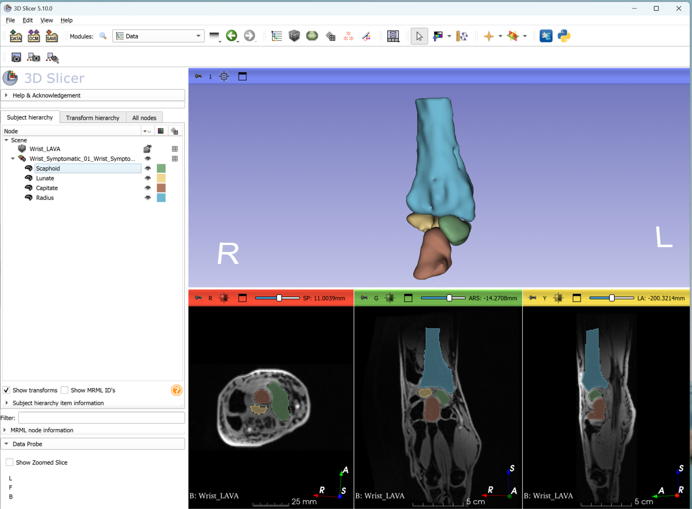
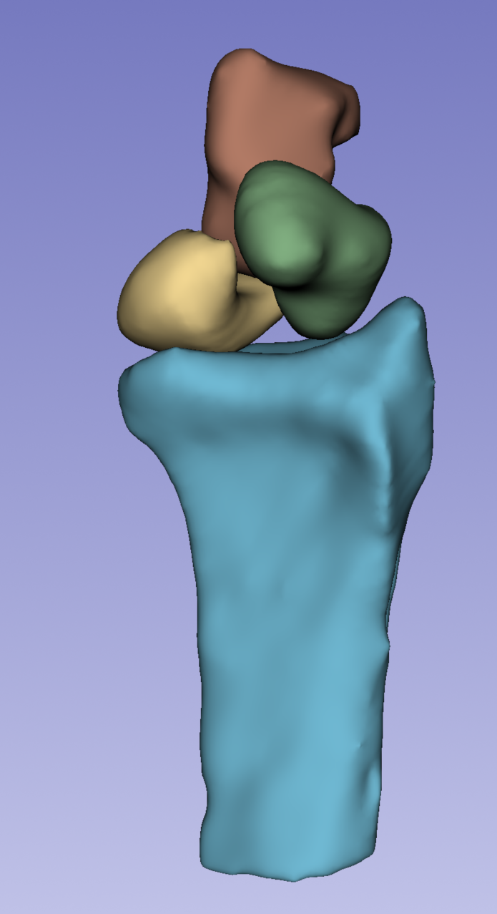

# Wrist MRI Segmentation using 3D Slicer

This repository demonstrates semi-automatic segmentation of wrist bones using 3D Slicer on a wrist MRI dataset. The example highlights a practical workflow for medical image segmentation and visualization.

## Dataset

Public dataset curated and made available by the author while at **Medical College of Wisconsin (MCW)**:  
https://data.mendeley.com/datasets/9kx5xp7h6d/2

The dataset includes:

- High-resolution wrist MRI  
- Dynamic wrist motion sequences (not included in this repository)  
- NIfTI format  

The dataset was curated, organized, and released to support reproducible research and medical image segmentation development.

## Segmentation Workflow

Semi-automatic segmentation was performed using **3D Slicer Segment Editor**.

### Tools Used

- Grow from Seeds  
- Paint  
- Smoothing  
- Manual refinement  

## Segmented Structures

The following wrist bones were segmented:

- Radius  
- Capitate  
- Scaphoid  
- Lunate  

## Workflow

1. Load high-resolution reference frame  
2. Apply Grow-from-Seeds segmentation  
3. Refine segmentation manually  
4. Visualize segmentation in 3D  
5. Export segmentation masks  

## Example

Example segmentation shown below:

### 3D Visualization

## Contribution

- Dataset curation and public release  
- Manual bone segmentation  
- Semi-automatic segmentation workflow in 3D Slicer  
- 3D visualization and quality control  

## Purpose

This example demonstrates:

- Semi-automatic medical image segmentation  
- Multi-bone wrist segmentation  
- 3D visualization in 3D Slicer  

## Applications

- Medical image annotation  
- Research prototyping  
- AI training dataset preparation  
